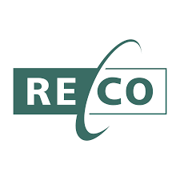

# RECO – Resume & Cover Letter Builder



**Author:** Ayush Singh Kaushik

A modern, AI-powered web application for creating professional resumes and cover letters with beautiful templates, real-time preview, and intelligent content generation.

## 🚀 Features

### 📄 Resume Builder
- **Multiple Professional Templates**: Modern, Classic, Creative, and Minimal designs
- **Real-time Preview**: See changes instantly in split-view mode
- **Comprehensive Sections**: Personal Info, Work Experience, Education, Skills, Projects, Certifications, Hobbies
- **Smart Navigation**: Horizontal section tabs for easy access
- **PDF Export**: High-quality PDF download functionality
- **Auto-save**: Automatic saving with visual indicators

### 📝 Cover Letter Builder
- **AI-Powered Content Generation**: Leverages Google Gemini AI for intelligent content creation
- **Industry-Specific Templates**: Tailored templates for different industries
- **Job Information Integration**: Automatically incorporates job details into content
- **Multiple Tabs**: Job Info, Content, Templates, and Preview sections
- **Copy to Clipboard**: Easy content sharing functionality
- **PDF Export**: Professional PDF generation

### 🎨 Modern UI/UX
- **Glassmorphism Design**: Beautiful semi-transparent elements with backdrop blur
- **Vibrant Gradients**: Eye-catching color schemes throughout the application
- **Framer Motion Animations**: Smooth transitions and micro-interactions
- **Floating Elements**: Animated decorative icons for visual appeal
- **Responsive Design**: Works seamlessly across all device sizes
- **Dark/Light Themes**: Consistent with modern design principles

### 🔐 Authentication & Security
- **Firebase Authentication**: Secure user management
- **Email/Password Login**: Traditional authentication method
- **Google Sign-in**: Quick social authentication
- **Protected Routes**: Secure access to builder features
- **User Session Management**: Persistent login state

### 💾 Data Management
- **Cloud Storage**: Firebase Firestore for data persistence
- **Real-time Sync**: Automatic data synchronization
- **Document Management**: Organized storage of resumes and cover letters
- **Version Control**: Track document changes and updates

## 🛠️ Technology Stack

- **Frontend**: React.js with Vite
- **Styling**: TailwindCSS with custom utilities
- **Animations**: Framer Motion
- **Icons**: React Icons
- **Authentication**: Firebase Auth
- **Database**: Firebase Firestore
- **AI Integration**: Google Gemini AI
- **PDF Generation**: html2canvas + jsPDF
- **State Management**: React Context API

## 📦 Installation

1. **Clone the repository**
   ```bash
   git clone <repository-url>
   cd resume-cover_letter-builder
   ```

2. **Install dependencies**
   ```bash
   npm install
   ```

3. **Environment Setup**
   - Copy `.env.example` to `.env`
   - Add your Firebase configuration:
     ```env
     VITE_FIREBASE_API_KEY=your_api_key
     VITE_FIREBASE_AUTH_DOMAIN=your_auth_domain
     VITE_FIREBASE_PROJECT_ID=your_project_id
     VITE_FIREBASE_STORAGE_BUCKET=your_storage_bucket
     VITE_FIREBASE_MESSAGING_SENDER_ID=your_sender_id
     VITE_FIREBASE_APP_ID=your_app_id
     VITE_GEMINI_API_KEY=your_gemini_api_key
     ```

4. **Add RECO Logo**
   - Place your logo image at: `src/assets/reco-logo.png`
   - Recommended dimensions: 200x60px (PNG format)
   - The logo will automatically appear in the dashboard header

5. **Start development server**
   ```bash
   npm run dev
   ```

## 🎯 Usage

### Getting Started
1. **Sign Up/Login**: Create an account or sign in with existing credentials
2. **Dashboard**: Access your documents and start building
3. **Choose Builder**: Select Resume Builder or Cover Letter Builder
4. **Select Template**: Choose from available professional templates
5. **Fill Information**: Complete sections with your details
6. **Preview**: Use split-view to see real-time changes
7. **Export**: Download as PDF when ready

### Resume Builder Workflow
1. Navigate through sections using horizontal tabs
2. Fill in personal information, work experience, education, etc.
3. Use the template selector to change designs
4. Toggle between Editor, Preview, and Split views
5. Download your completed resume as PDF

### Cover Letter Builder Workflow
1. Enter job information and company details
2. Use AI generation for intelligent content suggestions
3. Customize content based on industry and role
4. Preview your cover letter in real-time
5. Copy to clipboard or download as PDF

## 🎨 Logo Integration Instructions

**Dashboard Logo Placement:**
The RECO logo should be placed in the dashboard header. Follow these steps:

1. **Add logo file**: Place your logo image at `src/assets/reco-logo.png`

2. **Update Dashboard component**: The logo will be automatically integrated into the dashboard header with the following code structure:
   ```jsx
   import recoLogo from '../assets/reco-logo.png';
   
   // In the dashboard header:
   
   ```

3. **Logo specifications**:
   - **Format**: PNG with transparent background
   - **Dimensions**: 200x60px (3.33:1 aspect ratio)
   - **Style**: Clean, modern typography for "RECO"
   - **Colors**: Should work well with the gradient backgrounds

## 🚀 Deployment

1. **Build the project**
   ```bash
   npm run build
   ```

2. **Deploy to your preferred platform**
   - Vercel, Netlify, or Firebase Hosting
   - Ensure environment variables are configured

## 🤝 Contributing

1. Fork the repository
2. Create a feature branch (`git checkout -b feature/AmazingFeature`)
3. Commit your changes (`git commit -m 'Add some AmazingFeature'`)
4. Push to the branch (`git push origin feature/AmazingFeature`)
5. Open a Pull Request

## 📄 License

This project is licensed under the MIT License - see the LICENSE file for details.

## 👨‍💻 Author

**Ayush Singh Kaushik**
- Professional web developer specializing in modern React applications
- Expert in UI/UX design and AI integration
- Passionate about creating user-friendly, beautiful applications

## 🙏 Acknowledgments

- Google Gemini AI for intelligent content generation
- Firebase for robust backend services
- Framer Motion for smooth animations
- TailwindCSS for modern styling
- React community for excellent ecosystem

---

**RECO** - Revolutionizing the way professionals create resumes and cover letters with AI-powered assistance and beautiful design.